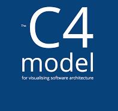

# Portfolio

<h1>Javier A. Rosado Baltazar</h1>  

**Developer .Net:** .Net Framework | .Net Core 3, 6  
**Developer Java:** Java Spring Framework | Spring Cloud  
**Developer Node:** NestJS Framework  
Developer Sr | IT Project Manager | Scrum Master  

**LinkedIn:** [Perfil en LinkedIn](https://www.linkedin.com/in/jrosadob/)  

## Overview
Relación de proyectos demostrativos, pruebas de concepto en diferentes lenguajes de programación, usando diferentes bases de datos y servicios.
Este portfolio es de reciente creación y aún estoy revisando los repositorios para ver si son funcionales y contienen código seguro para fines demostrativos.
Desde hace algún tiempo ya estoy usando SonarLint para el desarrollo y poder así generar código seguro.

##  API Rest con Java Spring Framework
### Applications:
+ [api_spring_crud_mysql](https://github.com/jrosadob-portfolio/api_spring_crud_mysql.git "Repository")
+ [api_spring_crud_sqlserver](https://github.com/jrosadob/jrosadob.github.io/blob/main/README.md "Repository")
+ [api_spring_crud_mariadb](https://ejemplo.com/ "Repository")
+ [api_spring_crud_oracle](https://ejemplo.com/ "Repository")
+ [api_spring_crud_mongodb](https://ejemplo.com/ "Repository")
+ [api_spring_crud_redis](https://ejemplo.com/ "Repository")
+ [API with Spring Batch using Tasklet][ApiSpringBatchTaskletRepository]  
  Ejemplo de Spring Batch usando Tasklet. Provee un endpoint para subir un archivo zip que contiene un archivo de datos en formato CSV, la aplicación ejecutará un proceso batch, que descomprimirá el archivo y cargará el contenido del archivo CSV en una base de datos MySQL.
+ [API with Spring Batch using Chunk][ApiSpringBatchChunkRepository]
+ [API with Spring Batch using Conditional Flow][ApiSpringBatchConditionalFlowRepository]
+ [Spring Scheduler][SpringSchedulerRepository]

### Maven Packages
+ Maven Packages 1><<a  >>
+ Maven Packages 2

##  API Rest con .Net Core
### Applications:
+ [api_netcore_crud_mysql](https://ejemplo.com/ "Repository")
+ [api_netcore_crud_sqlserver](https://ejemplo.com/ "Repository")
+ [api_netcore_crud_mariadb](https://ejemplo.com/ "Repository")
+ [api_netcore_crud_oracle](https://ejemplo.com/ "Repository")
+ [api_netcore_crud_mongodb](https://ejemplo.com/ "Repository")
+ [api_netcore_crud_redis](https://ejemplo.com/ "Repository")

### Nuget Pacakges
+ Nuget Packages 1
+ Nuget Packages 2

##  API Rest with NestJS1
### Applications:
+ [api_nestjs_crud_mysql](https://github.com/jrosadob-portfolio/api_nestjs_crud_mysql.git "Repository")
+ [api_nestjs_crud_sqlserver](https://github.com/jrosadob-portfolio/api_nestjs_crud_sqlserver.git "Repository")
+ [api_nestjs_crud_mariadb](https://github.com/jrosadob-portfolio/api_nestjs_crud_mariadb.git "Repository")
+ [api_nestjs_crud_oracle](https://github.com/jrosadob-portfolio/api_nestjs_crud_oracle.git "Repository")
+ [api_nestjs_crud_mongodb](https://github.com/jrosadob-portfolio/api_nestjs_crud_mongodb.git "Repository")
+ [api_nestjs_crud_redis](https://github.com/jrosadob-portfolio/api_nestjs_crud_redis.git "Repository")

### Libraries NPM:
+ Library 01
+ Library 02

## Application Architecture
###  With .Net Core
Applications:
+ [Layered Architecture](https://ejemplo.com/ "Repository")
+ Hexagonal Architecture
+ Clean Architecture

###  With Java Spring Framework
Applications:
+ [Layered Architecture](https://ejemplo.com/ "Repository")
+ [Hexagonal Architecture](https://ejemplo.com/ "Repository")
+ [Clean Architecture](https://ejemplo.com/ "Repository")

###  With NestJS 
Applications:
+ [Layered Architecture](https://ejemplo.com/ "Repository")
+ Hexagonal Architecture
+ Clean Architecture

###  Modelado BPM with Bizagi
+ Proceso de Xxxxx
+ Proceso de Xxxxx

###  The C4 model for visualising software architecture
+ PlantUML (Demo diagrams)
+ PuntosShoping (Application diagrams with c4model)

### OpenAPI
+ [Open API][OpenApiRepository]

### Docker & Docker compose
En el caso de Docker service, es un repositorio con diferentes docker-compose.yml para levantar diferentes servicios, como de bases de datos, Servicios SMTP fake, RabbitMq, Kafka entre otros.

Para el resto se muestra diferentes formas de construir imagenes y docker-compose.yml para construir y publicar imagenes optimizadas según el lenguaje de programación con la finalidad de subirlos a un repositorio de imagenes como DockerHub.
+ [Docker services][LinkRepository]  
+ [Docker for .Net Core][LinkRepository]  
+ [Docker for Spring Framework][LinkRepository]  
+ [Docker for NestJS][LinkRepository]  
+ [Docker for ...][LinkRepository]  

### Kunernetes

## CI/CD
### Gitlab CI/CD
### Github Actions
### Jenkins

## Microservices
En este sección se incluiran servicios orientados a los microservicios, elaborados básicamente con
+ Java Spring Framework
+ Net Core
+ NestJS  

### Services
+ [Spring Config Server][AppSpringConfigServer]
+ [Spring Config Client][AppSpringConfigClient]
+ [Eureka Server][AppEurekaServer]
+ Zuul Gateway
+ Hystrix
+ Resilience4J
+ [Spring Cloud Gateway][AppSpringCloudGateway]

## Other projects
+ Wraper Angular de Jitsi meet
+ Projecto de Agencia de viajes
+ Projecto de Cobranzas
+ RvPrint Solution

## Owner readme
Notas y documentación propia en formato README.md  
Los repositorios son privados.
+ [Git][ReadmeGitRepository]
+ [Typescript][ReadmeTypescriptRepository]
+ [Docker & Docker Compose][ReadmeDockerRepository]
+ [Kubernetes][ReadmeKubernetesRepository]

<!-- Repositories -->
[LinkRepository]: https://github.com
[OpenApiRepository]: https://github.com/jrosadob-portfolio/open-api

[ApiSpringBatchTaskletRepository]: https://github.com/jrosadob-portfolio/api_spring_batch_tasklet
[ApiSpringBatchChunkRepository]: https://github.com/jrosadob-portfolio/api_spring_batch_chunk
[ApiSpringBatchConditionalFlowRepository]: https://github.com/jrosadob-portfolio/api_spring_batch_conditional_flow
[AppSpringSchedulerRepository]: https://github.com/jrosadob-portfolio/app_spring_scheduler

[AppSpringConfigServer]: https://github.com/jrosadob-portfolio/app_spring_config_server
[AppSpringConfigClient]: https://github.com/jrosadob-portfolio/app_spring_config_client
[AppEurekaServer]: https://github.com/jrosadob-portfolio/app_spring_eureka_server
[AppSpringCloudGateway]: https://github.com/jrosadob-portfolio/app_spring_cloud_gateway

[ReadmeGitRepository]: https://github.com/jrosadob-readme/git
[ReadmeTypescriptRepository]: https://github.com/jrosadob-readme/git
[ReadmeDockerRepository]: https://github.com/jrosadob-readme/git
[ReadmeKubernetesRepository]: https://github.com/jrosadob-readme/git

[NetCoreCrudMySqlRepository]: 
[NetCoreCrudSqlServerRepository]: 
[NetCoreCrudMariaDbRepository]: 
[NetCoreCrudMongoDbRepository]: 

<!-- Demo uso de colores
TODOs:
- <r>TODO:</r> Important thing to do
- <o>TODO:</o> Less important thing to do
- <g>DONE:</g> Breath deeply and improve karma

 
-->
